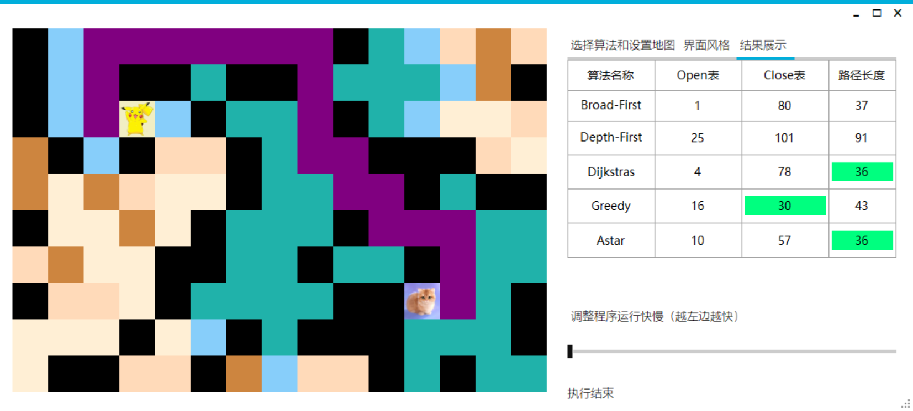
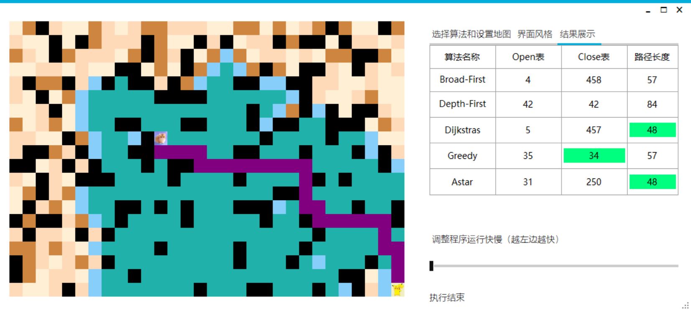
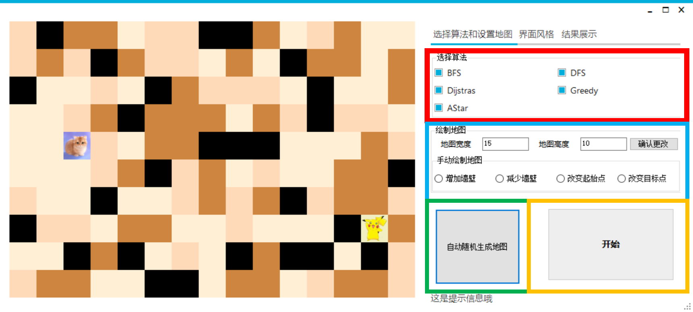

# MazeSolver

2D grid-based map and searching algirithms.

# Features

- Change the size of the map
- Change the initial point and target point
- Demostrate the search process in real time, with controlable rate.

# Thanks to

- [AndyBobBean/PathFinding](https://github.com/AndyBobBean/PathFinding)
- [peters/winforms-modernui](https://github.com/peters/winforms-modernui)
